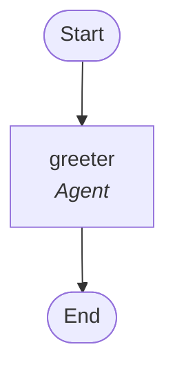

# Mermaid Diagram Export

## Overview

The agent runtime provides built-in support for exporting workflow definitions and execution results as **Mermaid flowchart diagrams**. This enables visual documentation, debugging, and sharing of workflow structures.

## Features

### 1. Structure-Only Diagrams

Generate diagrams showing workflow topology without execution data:

```rust
let workflow = Workflow::builder()
    .step(Box::new(AgentStep::new(greeter)))
    .step(Box::new(TransformStep::new("extract", transform_fn)))
    .step(Box::new(ConditionalStep::new("check", condition, then_step, else_step)))
    .build();

let mermaid = workflow.to_mermaid();
println!("{}", mermaid);
```

### 2. Execution Result Diagrams

Generate diagrams annotated with execution metrics:

```rust
let runtime = Runtime::new();
let run = runtime.execute(workflow).await;

let mermaid = run.to_mermaid_with_results();
println!("{}", mermaid);
```

Shows:
- ✅ Success/failure state (green/red highlighting)
- ⏱️ Execution time per step
- 📊 Step completion status

## Step Type Visualization

Different step types use distinct node shapes:

| Step Type | Mermaid Shape | Example |
|-----------|---------------|---------|
| **Agent** | Rounded box `[]` | `["greeter<br/><i>Agent</i>"]` |
| **Transform** | Parallelogram `[/ /]` | `[/"extract<br/><i>Transform</i>"/]` |
| **Conditional** | Diamond `{}` | `{"check<br/><i>Conditional</i>"}` |
| **SubWorkflow** | Double-border `[[ ]]` | `[["pipeline<br/><i>Sub-Workflow</i>"]]` |
| **Parallel** | Hexagon `{{}}` | `{{{{"parallel<br/><i>Parallel</i>"}}}}` |
| **Custom** | Rounded box `[]` | `["custom<br/><i>CustomType</i>"]` |

## Color Coding

### Structure Diagrams
- **Agent steps**: Light blue (`#e1f5ff`)
- **Transform steps**: Light purple (`#f3e5f5`)
- **Conditional steps**: Light orange (`#fff3e0`)
- **SubWorkflow steps**: Light green (`#e8f5e9`)

### Execution Diagrams
- **Success**: Green (`#c8e6c9`)
- **Failure**: Red (`#ffcdd2`)

## Usage Examples

### Save to File

```rust
use std::fs;

let mermaid = workflow.to_mermaid();
fs::write("workflow.mmd", mermaid)?;
```

### Embed in Markdown

````markdown
# My Workflow


````

### View Online

1. Copy generated Mermaid code
2. Visit https://mermaid.live/
3. Paste and view interactive diagram

### VS Code Integration

Install the **Mermaid Preview** extension, then:
```bash
code workflow.mmd
```

## API Reference

### `Workflow::to_mermaid()`

Generates structure-only Mermaid diagram.

**Returns:** `String` - Mermaid flowchart syntax

**Example:**
```rust
let diagram = workflow.to_mermaid();
```

### `WorkflowRun::to_mermaid_with_results()`

Generates diagram with execution results.

**Returns:** `String` - Mermaid flowchart syntax with execution annotations

**Features:**
- Green/red highlighting based on success/failure
- Execution time per step (in milliseconds)
- Step completion status

**Example:**
```rust
let run = runtime.execute(workflow).await;
let diagram = run.to_mermaid_with_results();
```

## Complex Workflow Example

```rust
// Define workflow
let workflow = Workflow::builder()
    .step(Box::new(AgentStep::new(input_validator)))
    .step(Box::new(TransformStep::new("parse", parse_fn)))
    .step(Box::new(ConditionalStep::new(
        "is_valid",
        validation_check,
        Box::new(success_pipeline),
        Box::new(error_handler),
    )))
    .step(Box::new(SubWorkflowStep::new("process", processing_wf)))
    .step(Box::new(AgentStep::new(summarizer)))
    .build();

// Generate structure diagram
let structure = workflow.to_mermaid();
fs::write("structure.mmd", structure)?;

// Execute
let run = runtime.execute(workflow).await;

// Generate results diagram
let results = run.to_mermaid_with_results();
fs::write("results.mmd", results)?;
```

**Generated Structure:**


## Best Practices

### 1. Descriptive Names
Use clear step names for readable diagrams:
```rust
// ✅ Good
TransformStep::new("extract_user_id", fn)

// ❌ Bad
TransformStep::new("t1", fn)
```

### 2. Version Control
Commit `.mmd` files alongside code:
```bash
git add workflow_structure.mmd
git commit -m "Update workflow diagram"
```

### 3. Documentation
Include diagrams in README files:
````markdown
## System Architecture

```mermaid
[paste diagram here]
```
````

### 4. CI/CD Integration
Generate diagrams in CI pipeline:
```yaml
- name: Generate diagrams
  run: cargo run --bin generate_docs
```

### 5. Comparison
Compare before/after for reviews:
```bash
# Before changes
cargo run --bin my_workflow > before.mmd

# After changes  
cargo run --bin my_workflow > after.mmd

# Compare
diff before.mmd after.mmd
```

## Limitations

### Current
- Linear flows only (no branching visualization in diagram, though ConditionalStep exists)
- SubWorkflow contents not expanded (shows as single node)
- No support for parallel execution branches (in single diagram)
- Maximum diagram size ~100 steps (Mermaid browser limitations)

### Future Enhancements
- **Nested expansion**: Option to inline sub-workflow contents
- **Parallel branches**: Show concurrent execution paths side-by-side
- **Interactive diagrams**: Click nodes to view step details
- **Diff visualization**: Highlight changes between workflow versions
- **Live updates**: Real-time diagram updates during execution
- **Custom styling**: User-defined colors and shapes per step type

## Integration Examples

### Web Dashboard

```rust
use actix_web::{web, HttpResponse};

async fn get_workflow_diagram(workflow_id: web::Path<String>) -> HttpResponse {
    let workflow = load_workflow(&workflow_id).await;
    let mermaid = workflow.to_mermaid();
    
    HttpResponse::Ok()
        .content_type("text/plain")
        .body(mermaid)
}
```

### CLI Tool

```rust
use clap::Parser;

#[derive(Parser)]
struct Args {
    #[arg(short, long)]
    output: PathBuf,
}

fn main() {
    let args = Args::parse();
    let workflow = build_workflow();
    let mermaid = workflow.to_mermaid();
    
    fs::write(args.output, mermaid)
        .expect("Failed to write diagram");
}
```

### Testing

```rust
#[test]
fn test_diagram_generation() {
    let workflow = Workflow::builder()
        .step(Box::new(AgentStep::new(test_agent)))
        .build();
    
    let diagram = workflow.to_mermaid();
    
    assert!(diagram.contains("flowchart TD"));
    assert!(diagram.contains("test_agent"));
    assert!(diagram.contains("Agent"));
}
```

## Troubleshooting

### Diagram Not Rendering

**Problem:** Mermaid syntax error

**Solution:** Validate at https://mermaid.live/

### Step Names with Special Characters

**Problem:** Breaks Mermaid syntax

**Solution:** Step names are auto-escaped (quotes handled)

### Large Workflows

**Problem:** Diagram too complex to read

**Solution:** 
- Break into sub-workflows
- Generate separate diagrams per subsection
- Use `to_mermaid()` on individual sub-workflows

## See Also

- [Mermaid Documentation](https://mermaid.js.org/)
- [Workflow Composition](./WORKFLOW_COMPOSITION.md)
- [Step Abstraction](./STEP_ABSTRACTION.md)
- [Event Broadcasting](./EVENT_BROADCASTING.md)
