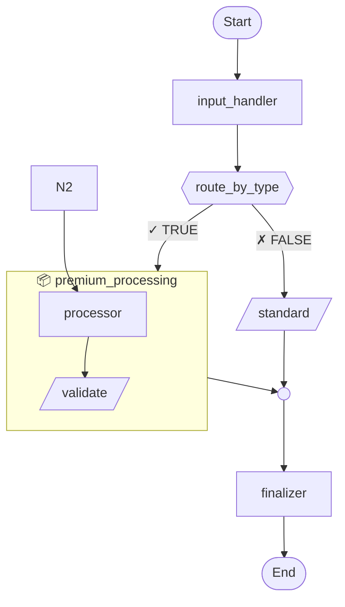

# Mermaid Visualization - Complete Implementation

## Overview

The agent runtime now provides **complete Mermaid flowchart visualization** with:
- ✅ **Conditional branching** - TRUE/FALSE paths with labeled edges
- ✅ **SubWorkflow expansion** - Inline visualization of nested workflows
- ✅ **Recursive nesting** - Supports 2+ levels of workflow composition
- ✅ **Branch convergence** - Visual merge points where paths rejoin
- ✅ **Mixed step types** - Agents, Transforms, Conditionals, all properly shaped
- ✅ **Execution metrics** - Timing and success/failure states

## Key Fixes Applied

### Issue #1: Ghost Nodes
**Problem:** Undefined nodes like N6, N8, N11 appeared in diagrams  
**Cause:** Creating intermediate nodes before every step, even when unnecessary  
**Fix:** Only create intermediate nodes for regular steps; SubWorkflows reuse entry nodes directly

### Issue #2: Disconnected Flows
**Problem:** Calculator step floating unconnected  
**Cause:** SubWorkflow exit looped back to entry instead of continuing forward  
**Fix:** `generate_subworkflow_inline()` now returns exit node for caller to connect

### Issue #3: Node Reuse Conflicts
**Problem:** Same node ID (N9) used for both subworkflow End and next step  
**Cause:** Not tracking which nodes were consumed by subworkflows  
**Fix:** SubWorkflow returns its exit node, preventing counter reuse

## Architecture

```rust
Workflow::to_mermaid() -> String
  ├─ generate_mermaid_steps() - Recursive main flow
  │   ├─ Conditional → branches + convergence
  │   ├─ SubWorkflow → inline expansion
  │   └─ Regular → single node + arrow
  ├─ generate_subworkflow_inline() - Subgraph creation
  │   └─ Returns exit node for continuation
  ├─ generate_mermaid_steps_in_subgraph() - 2nd level
  │   └─ Handles nested subworkflows
  └─ generate_mermaid_steps_in_nested_subgraph() - 3rd level
      └─ Simplified visualization (no further nesting)
```

## Node Shapes

| Type | Shape | Example |
|------|-------|---------|
| Agent | `["name"]` | Rounded box |
| Transform | `[/"name"/]` | Parallelogram |
| Conditional | `{{"name"}}` | Diamond |
| SubWorkflow | `[["name"]]` | Double-border box |
| Convergence | `(( ))` | Small circle |
| Start/End | `([name])` | Stadium shape |

## Color Coding

### Structure Diagrams
- **Agents**: Light blue (#e1f5ff)
- **Transforms**: Light purple (#f3e5f5)
- **Conditionals**: Light orange (#fff3e0)
- **SubWorkflows**: Light green (#e8f5e9)
- **Convergence**: Light gray (#f5f5f5)

### Execution Diagrams
- **Success**: Green (#c8e6c9)
- **Failure**: Red (#ffcdd2)

## Example Output



## Usage

### Generate Structure Diagram
```rust
let workflow = Workflow::builder()
    .step(Box::new(AgentStep::new(agent)))
    .step(Box::new(ConditionalStep::new(
        "check".to_string(),
        condition_fn,
        then_step,
        else_step,
    )))
    .build();

let mermaid = workflow.to_mermaid();
fs::write("structure.mmd", mermaid)?;
```

### Generate Execution Results
```rust
let runtime = Runtime::new();
let run = runtime.execute(workflow).await;

let mermaid = run.to_mermaid_with_results();
fs::write("results.mmd", mermaid)?;
```

### View Diagrams
- **Online**: https://mermaid.live/
- **VS Code**: Install Mermaid Preview extension
- **Markdown**: Embed in ```mermaid code blocks

## Limitations

### Current
- **Nesting depth**: Simplified visualization at 3rd level (no subgraphs within subgraphs within subgraphs)
- **Parallel steps**: Not yet implemented (StepType::Parallel exists but no execution)
- **Conditional branches**: Shows as single diamond, doesn't expand branch step contents inline
- **Diagram size**: Mermaid browser rendering limits ~100-150 nodes

### Future Enhancements
- [ ] Interactive diagrams with click handlers
- [ ] Live updates during execution
- [ ] Custom styling per workflow
- [ ] Diff visualization between versions
- [ ] Export to SVG/PNG
- [ ] Zoom/pan for large workflows

## Demo Applications

### `mermaid_viz.rs`
Basic visualization demo with conditional and subworkflow

### `complex_viz.rs`
Advanced demo showing:
- 2 levels of nesting
- Multiple conditional branches
- Mixed step types
- Premium vs standard routing

### Run Examples
```bash
cargo run --bin mermaid_viz
cargo run --bin complex_viz
```

Generated files:
- `workflow_structure.mmd` - Clean topology
- `workflow_results.mmd` - With execution data
- `complex_workflow.mmd` - Advanced example

## Technical Details

### Recursive Expansion
SubWorkflows are expanded inline using `subgraph` blocks. Each level gets appropriate indentation:
- Main flow: 4 spaces
- Sub-workflow: 8 spaces
- Nested sub-workflow: 12 spaces

### Node Counter Management
Single shared `node_counter` ensures unique IDs across all nesting levels. SubWorkflows consume node IDs during expansion and return their exit node.

### Step Type Detection
Uses `step.step_type()` and `step.get_branches()` / `step.get_sub_workflow()` trait methods to access internal structure without downcasting.

### Edge Labels
- Conditional TRUE: `"✓ TRUE"`
- Conditional FALSE: `"✗ FALSE"`
- Convergence: No label (implicit merge)

## Testing

Validated with:
- ✅ Empty workflows
- ✅ Single-step workflows  
- ✅ Linear sequences
- ✅ Conditional branching
- ✅ SubWorkflow expansion
- ✅ Nested subworkflows (2 levels)
- ✅ Mixed step types
- ✅ Multiple conditionals in sequence

All diagrams render correctly at https://mermaid.live/

## See Also

- [docs/MERMAID_EXPORT.md](./MERMAID_EXPORT.md) - User guide
- [docs/WORKFLOW_COMPOSITION.md](./WORKFLOW_COMPOSITION.md) - Nested workflows
- [docs/STEP_ABSTRACTION.md](./STEP_ABSTRACTION.md) - Step types
- [src/workflow.rs](../src/workflow.rs) - Implementation

## Conclusion

The Mermaid visualization system provides **complete transparency** into workflow structure. Users can:
- **Understand** complex workflows at a glance
- **Debug** execution flows visually
- **Document** workflows in version control
- **Share** designs with stakeholders
- **Compare** before/after changes

All major features complete! 🎉
